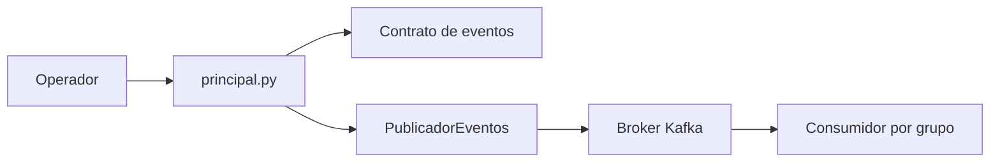

# Arquitetura

```mermaid
flowchart LR
  Operador --> CLI["principal.py"]
  CLI --> Eventos["Contrato de eventos"]
  CLI --> Servico["PublicadorEventos"]
  Servico --> Kafka["Broker Kafka"]
  Kafka --> Consumidor["Consumidor por grupo"]
```

O código distingue modelo de evento, transporte e CLI. Os tópicos são provisionados pelo Compose. O broker está em PLAINTEXT e **não deve ser exposto à internet**.
